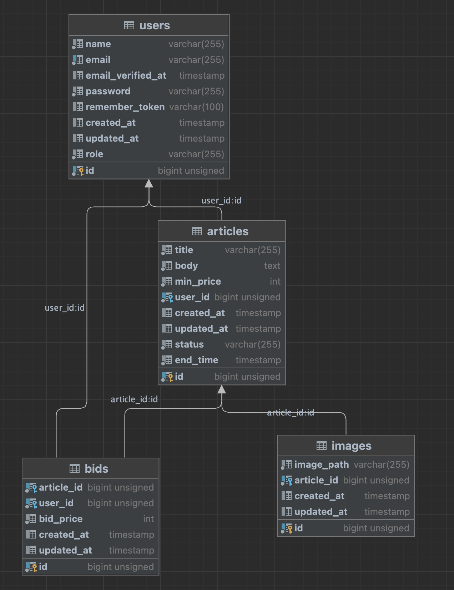

<p align="center"><a href="https://laravel.com" target="_blank"></a></p>

## Database Structure

The app database is structured in these tables:

- users (contains registered users to the app)
- articles (contains of articles)
- images (contains uploaded images and their path)
- bids (contains the bids in a specific article)



## how to run in local

Using docker we could use the tool Sail to setup the project locally

```shell

    # The install command reads the composer.json file from the current directory, resolves the dependencies, and installs them into vendor . php composer.phar               install.
    composer install

    # To run all of outstanding migrations, execute the migrate Artisan command:
    php artisan migrate
    
    # Create user admin
    php artisan users:create --name=admin --email=admin@gmail.com --password=123456
    
    # Create storage symlink in public folder
    php artisan storage:link
    
    # This command downloads a package and its dependencies
    npm install
    
    # This command creates a build directory with a production version of your application
    npm run build
    
    # The Laravel PHP artisan serve command helps running applications on the PHP development server
    php  artisan serve 
    
```

## Scheduler

We are using the scheduler to check every minute if there is an article that has status live and the end time has arrived, so we send a notification via email to the seller and the buyer.

For that we should run this command

```shell
  # example
  php artisan schedule:run
```

